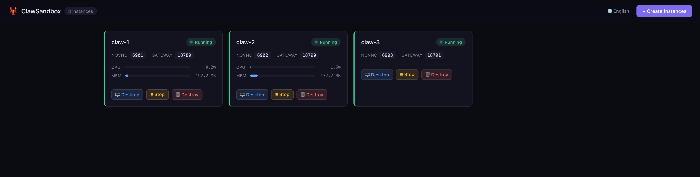

# ClawSandbox

> 把一个 OpenClaw，扩成一整个彼此隔离的 AI 小队。

[English](./README.md)

---

**在一台机器上运行多只 OpenClaw，每只都有独立身份、凭证、浏览器会话、数据和故障边界。**

当一个 assistant 开始变成一个小队时，ClawSandbox 才真正有意义：

- **一只 claw，一个身份** — 对应独立的 Telegram / WhatsApp / Slack 账号
- **一只 claw，一层边界** — 容器、文件系统、浏览器、端口和运行状态全部隔离
- **一只 claw，一套预算** — 每只 claw 可使用不同模型、prompt、API Key、skills 和实验配置
- **稳定运行一只，放心试验一只** — 主实例继续跑，另一只专门用来测试和折腾

不用额外买 Mac Mini，不必默认上云，直接跑在你已有的机器上。

## 为什么不直接用一个 OpenClaw？

OpenClaw 本身已经支持多 agent，甚至支持同机运行多个 Gateway。ClawSandbox 要解决的是更强的一层：**运行时隔离**。

如果你只需要一个助手，先从单个 OpenClaw 开始。只有在下面这些场景里，ClawSandbox 才真正有价值：

- 你需要不同的 bot / channel 账号
- 你需要不同的 API Key、模型提供商或技能集
- 你需要不同的浏览器 session 或长期自动化状态
- 你需要区分 prod / staging / backup claws

## ClawSandbox 能做什么

- **一条命令部署军团** — 给一个数字，就能得到对应数量的隔离 OpenClaw 实例
- **Web 仪表盘** — 在浏览器中管理整个军团，实时资源监控、一键操作、内嵌 noVNC 桌面
- **每个实例独立桌面** — 每只龙虾运行在独立的 Docker 容器中，内含 XFCE 桌面，通过 noVNC 在任意浏览器中访问
- **生命周期管理** — 通过 CLI 或仪表盘创建、启动、停止、重启、销毁实例
- **数据持久化** — 每个实例的数据在容器重启后保留
- **资源隔离** — 实例之间以及与宿主系统之间完全隔离

## 你需要的环境

- **macOS 或 Linux**
- **Docker 已安装且正在运行** — 大多数用户就是先打开 [Docker Desktop](https://www.docker.com/products/docker-desktop/)，确认 engine 已启动
- **终端里的 Docker 可用** — 继续之前先确保 `docker version` 能成功
- **Go 1.25+ 和 `make`** — 只有按下面方式从源码构建 ClawSandbox 时才需要
- **足够的本地资源** — 至少 8 GB 内存、10+ GB 可用磁盘；如果要同时跑多只 claw，建议 16 GB 内存
- **首次运行需要联网** — 在全新机器上，本地构建镜像会下载基础层、依赖和浏览器资源

## 首次启动预期

当前推荐的首次启动路径是：

- **先在本地构建镜像** — 在创建任何实例之前先运行 `clawsandbox build`
- **再启动 Dashboard 或使用 CLI** — 一旦本地镜像准备好，创建实例通常就是秒级
- **第一次本地构建不会很快** — 一台全新的机器通常需要几分钟

如果 Docker 没有启动，ClawSandbox 会直接报错。先启动 Docker，再继续。

## 快速开始

### 1. 构建 CLI

```bash
git clone https://github.com/weiyong1024/ClawSandbox.git
cd ClawSandbox
make build
# 可选：安装到系统 PATH（若不执行，后续命令请用 ./bin/clawsandbox 替代 clawsandbox）
sudo make install
```

### 2. 确认 Docker 已就绪

继续前，先确认 Docker 在终端里可用：

```bash
docker version
```

如果失败，先打开 Docker Desktop，等 engine 启动完成。

### 3. 先跑一次预检

先让 ClawSandbox 用更直白的话告诉你当前状态：

```bash
clawsandbox doctor
```

它会告诉你：

- Docker 是否可达
- 本地镜像是否已经存在
- 当前应该走哪条启动路径
- 下一步该执行什么

### 4. 先在本地构建 Docker 镜像

第一次创建实例前，请先在本地构建镜像（镜像约 4 GB，全新机器通常需要几分钟）：

```bash
clawsandbox build
```

### 5. 部署龙虾军团

**方式 A：Web 仪表盘（推荐）**

```bash
# 启动仪表盘
clawsandbox dashboard serve
```

在浏览器中打开 [http://localhost:8080](http://localhost:8080)，点击 **「创建实例」**，选择数量即可。



仪表盘提供：
- 所有实例的实时 CPU / 内存监控
- 一键 启动 / 停止 / 销毁 操作
- 点击实例卡片上的 **「桌面」**，进入详情页，内嵌 noVNC 桌面、实时日志和资源图表


**方式 B：CLI**

```bash
# 创建 3 个隔离的 OpenClaw 实例
clawsandbox create 3

# 查看状态
clawsandbox list
```

### 6. 配置每只龙虾

每只龙虾需要通过其桌面完成一次初始化。可以在仪表盘点击 **「桌面」** 打开，也可以用 CLI：

```bash
clawsandbox desktop claw-1
```

在桌面的终端中执行：

```bash
# 第一步：运行初始化向导（配置 LLM API Key、Telegram Bot 等）
openclaw onboard --flow quickstart

# 第二步：启动 Gateway
openclaw gateway --port 18789
```

Gateway 启动后，在桌面的 **Chromium 浏览器**中访问终端输出的地址（形如 `http://127.0.0.1:18789/#token=...`），即可打开 OpenClaw 控制台。

## CLI 命令

任何命令都可以加 `--help` 查看详细用法和示例：

```bash
clawsandbox --help              # 查看所有可用命令
clawsandbox dashboard --help    # 查看 dashboard 子命令组
```

常用命令速查：

```bash
clawsandbox doctor                      # 运行预检并给出下一步建议
clawsandbox create <N>                  # 创建 N 个龙虾实例（新机器先运行 `clawsandbox build`）
clawsandbox list                        # 列出所有实例及状态
clawsandbox desktop <name>              # 在浏览器中打开实例桌面
clawsandbox start <name|all>            # 启动已停止的实例
clawsandbox stop <name|all>             # 停止运行中的实例
clawsandbox restart <name|all>          # 重启实例（先停止再启动）
clawsandbox logs <name> [-f]            # 查看实例日志
clawsandbox destroy <name|all>          # 销毁实例（默认保留数据）
clawsandbox destroy --purge <name|all>  # 销毁实例并删除数据
clawsandbox dashboard serve              # 启动 Web 仪表盘
clawsandbox dashboard stop               # 停止 Web 仪表盘
clawsandbox dashboard restart            # 重启 Web 仪表盘
clawsandbox dashboard open               # 在浏览器中打开仪表盘
clawsandbox build                        # 为首次运行、离线或自定义场景构建本地镜像
clawsandbox config                       # 显示当前配置
clawsandbox version                      # 查看版本信息
```

## 重置

销毁所有实例（含数据）、停止 Dashboard、清除构建产物，恢复到全新状态：

```bash
make reset
```

重置后从[快速开始](#快速开始)第 1 步重新开始。

## 资源占用参考

测试环境：M4 MacBook Air（16 GB 内存）

| 实例数 | 内存（空闲） | 内存（Chromium 活跃） |
|--------|-------------|----------------------|
| 1      | ~1.5 GB     | ~3 GB                |
| 3      | ~4.5 GB     | ~9 GB                |
| 5      | ~7.5 GB     | 不建议               |

## 项目状态

正在积极开发中。CLI 和 Web 仪表盘均已可用。

欢迎提 Issue 或 PR 参与贡献。
安全策略见 [SECURITY.md](./SECURITY.md)，贡献说明见 [CONTRIBUTING.md](./CONTRIBUTING.md)。

## License

MIT
